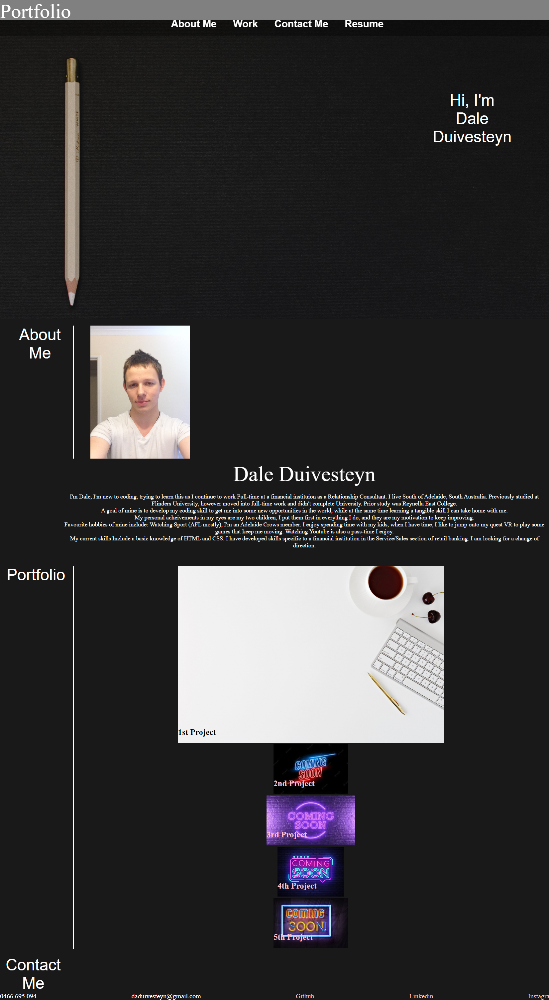

# Portfolio
Description
We were given a task to create a Portfolio.
This is my first time designing a website, and thus has been challenging.
This Portfolio had a strong element of Flexbox's and a need to know them. Even once submitting I will still be working on this project, maybe creating a new one entirely, as I am interested in having a portfolio page, however I need to start fresh, and have simply ran out of time, with this being my 2nd or 3rd attempt at making a portfolio. I still have a lot to learn about flexbox, and media query.
This homework challenge has taught me how to use Mediaquery, however I am experiencing some troubles with some properties.
My biggest hurdle would be fixing one issue, which would then cause another. I need to simplify things in the future and try and find a holistic solution.

To begin with I have a basic heading, which should be seen on the right hand side. 
A Sticky NavBar that has four headings (resume has yet to be uploaded, so currently doesn't operate) "About Me", "Workk" and "Contact Me" should all snap to the relative sections.
Followed is the portfolios heading/title, where I great you with my name included (background image also applied)

Next section is the about me part of the portfolio, which has an inline heading on the left, followed by a border, then a picture of myself, followed by some details about me. All of these will be in line depending on zoom/screen size, where the text will begin to fit underneath.

then we move to the portfolio section, where I couldn't quite get the images to line up 1 by 2 by 2 after inputting text within them. Each image will take you to a temporary "Example.com" link while they are yet to be filled. Each attribute has a hover affect to make it obvious you are on the right link.

Then we have Contact me section, which has my details and relative links to my profiles.

Installation
N/A

Usage
https://daleduiv.github.io/Portfolio/

Portfolio

Credits
https://adelaide.bootcampcontent.com/the-university-of-adelaide/UADEL-VIRT-FSF-PT-08-2022-U-LOLC/-/tree/main/01-HTML-Git-CSS
https://adelaide.bootcampcontent.com/the-university-of-adelaide/UADEL-VIRT-FSF-PT-08-2022-U-LOLC/-/tree/main/02-Advanced-CSS
https://www.youtube.com/c/WebDevSimplified
https://www.w3schools.com/css/css3_flexbox_responsive.asp
Alexis San Javier; Tutor

License
MIT License

Badges
N/A

Features
N/A

How to Contribute
N/A

Tests
N/A

Resources

Images:
https://media.gettyimages.com/photos/coming-soon-neon-lights-picture-id1300574553?s=612x612
https://img.freepik.com/free-vector/neon-style-coming-soon-glowing-background-design_1017-25516.jpg?w=2000
https://unsplash.com/photos/VieM9BdZKFo
https://www.gettyimages.fi/photos/coming-soon
https://unsplash.com/photos/tk9RQCq5eQo
<a href="https://www.freepik.com/free-photo/3d-landscape-grassy-hill-with-clouds-blue-sky_23026603.htm">Image by kjpargeter</a> on Freepik
